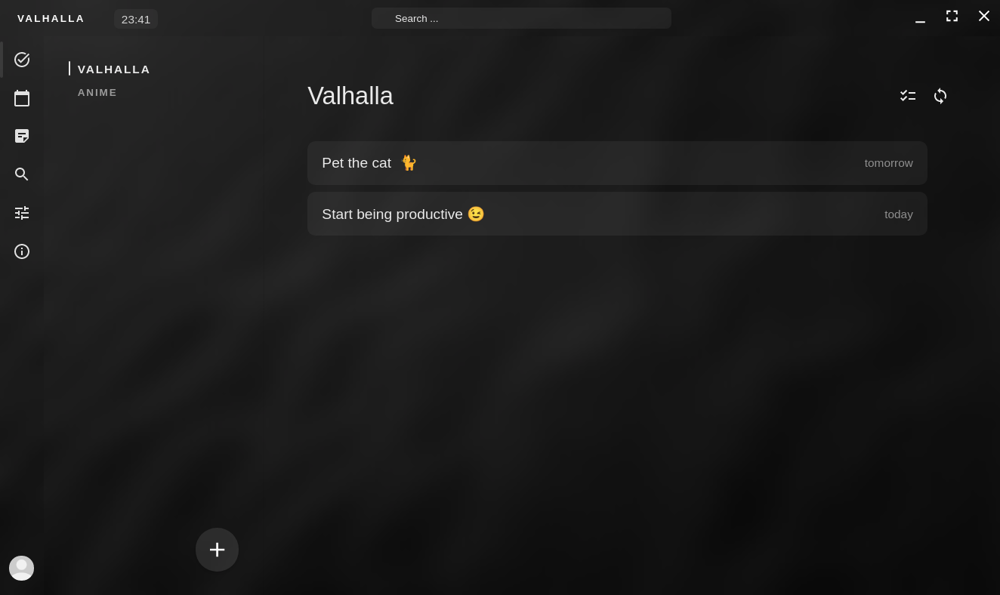
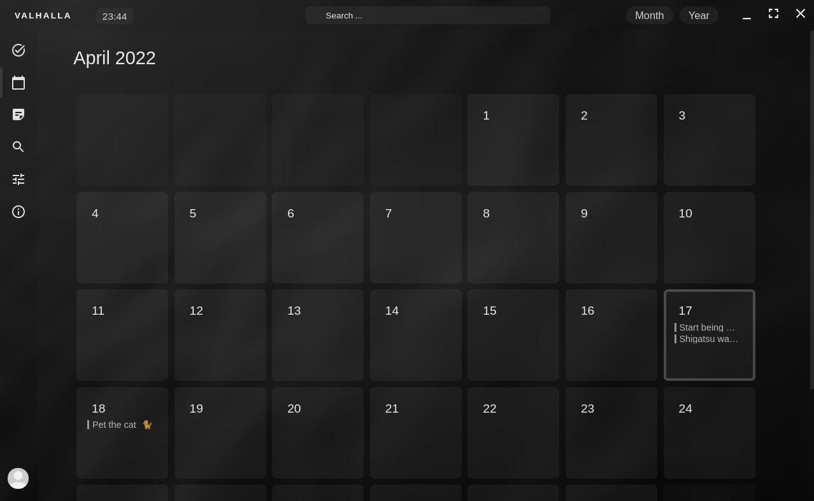

# 💻 | Valhalla - The modern productivity app 
Valhalla is a productivity app that helps you manage your tasks and projects.

💙 | The user experience is important for us, so we've designed the app to be as intuitive as possible.

🔐 | No internet connection required, valhalla can be used in "offline" mode so your personal information stay secure on your computer and only accessible for you. 

For more information, please visit [our page.](https://akrck02.github.io/#/software/valhalla)

 

## ☕️ | Open Source, for the community 

This project is open source and is maintained currently by [**@akrck02**](https://github.com/akrck02). GPL 3.0 License is used in this project. [More info here.](./LICENSE)

### Contributing
    Want to help? Fork this project and make a pull request! 

You can make any changes you want to the code, if you want to contribute to the project, but please make sure to follow the [contributing guidelines](CONTRIBUTING.md).

Ones your pull request is accepted, your change will be added to the dev branch as official part of the project and your name will be added to the contributors list.

If your code is rejected, please read the feedback and follow the guidelines to try again.

any questions? please [contact me](mailto:akrck02@gmail.com)

 

## ⚙️ | Hardware requirements

### Minimum requirements:
- CPU : Dual core Intel Core i5-3570 or AMD Phenom II X4 940 or better
- RAM : 4GB
- GPU : Intel HD Graphics 4000 or better

### Recommended requirements:
- CPU : Dual core Intel Core i7-4790 or AMD FX-8350 or better
- RAM : 6GB
- GPU : Intel HD Graphics 5000 or better

### Mega-PC requirements:
- CPU : Threadripper 3950X or better
- RAM : 128GB
- GPU : RTX 3090 or better

 

## ✅ | Supported Platforms 

Valhalla is currently supported on the following platforms:

     
    <b> &nbsp;|&nbsp; Windows <i>(Recommended: 10 or later)</i></b>

     
    <b> &nbsp;|&nbsp; Fedora  <i>(Recommended: 34 or later)</i></b>

     
    <b> &nbsp;|&nbsp; Ubuntu -  <i>(Recommended: 20.04 or later)</i></b>

     
    <b> &nbsp;|&nbsp; Linux -  <i>(Required: .appImage support)</i></b>

 

